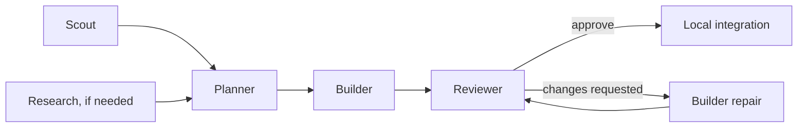

# How pinata runs a job

pinata delegates tasks to separate Pi processes and brings their results back to
one coordinator. Herdr provides the workspaces. Git worktrees keep builders'
changes separate until they pass review.

This page explains the design. For a working example, follow
[Build and review a change](tutorials/build-and-review.md).

## Skills, personas, and workers

The coordinator is your main Pi conversation. It decides what to delegate and
remains responsible for the final result.

The `subagents` skill teaches the coordinator how to create and manage a run.
It activates for explicit delegation requests. The `engmgmt` skill adds a coding
workflow: inspect, plan when needed, build, review, repair, and integrate. You
invoke it explicitly with `/skill:engmgmt`; it then reads `subagents`. Pi does not
provide implicit skill inheritance.

Personas are prompt templates for five roles:

| Role     | Main question                                                   |
| -------- | --------------------------------------------------------------- |
| Scout    | Where does this behavior live in the repository?                |
| Research | What do inspected external sources say about it?                |
| Planner  | What should change, in what order, and how will we check it?    |
| Builder  | Can I implement this assignment within the owned paths?         |
| Reviewer | Does the actual plan or change satisfy its acceptance criteria? |

You do not need every role for every job. A scout can answer a local code question
alone. A small fix may need only a builder and reviewer.

Typing `/builder` in Pi uses that prompt in the current conversation. It does not
create a worker. A delegated worker is a new Pi process launched by the helper,
with its own task, model, tools, and session directory.

## A run is a dependency graph

A task's `after` list names the tasks it depends on. Ready tasks can run in
parallel, up to three workers by default. A failed required predecessor blocks
its dependents. One successful task cannot stand in for the rest of the group.

This diagram shows one possible job, not a mandatory sequence. Research that
needs a version discovered by the scout must wait for the scout.

`start` runs one background coordinator per run until its tasks settle; it
collects results and launches downstream work without repeated agent tool calls.
`tick`, `resume`, and `wait` also support explicit synchronous coordination.
Workers run under their own supervisors. `status` reads saved task state and
reports if a recorded background coordinator has stopped.

## Worktrees and ownership

Each run records the repository's committed `HEAD`. Worker worktrees begin at
that commit. They do not receive arbitrary uncommitted changes from your working
tree. A dependent builder receives verified changes from predecessor builders.

Because ignored files are not in the commit, a fresh worktree has no installed
dependencies. Before a builder starts, its worker runs one setup command there,
detected from the root lockfiles or set with `config.setup`. The supervisor runs
it, not the model, and it must leave tracked and unignored files unchanged, so
setup output can never become part of a deliverable. Workers themselves still
may not install packages. This is the same split Codex cloud uses: a setup phase
prepares the environment, then the agent works in it. See
[Give builders their dependencies](dependencies.md).

Each builder declares the files or directory prefixes it may change. Independent
builders cannot own overlapping paths. Dependent builders can, because their
ordering is explicit. These checks apply within a run; separate runs have no
shared ownership lock.

A reviewer inspects its target's actual worktree and evidence. It does not review
a paraphrase of the change. When a repair changes the evidence, the old review
no longer approves it.

## Why an idle pane is not success

Pi can report an assistant error and still exit with code zero. Herdr pane status
also says nothing about whether a task met its acceptance criteria.

In Herdr panes, Pi runs interactively on the pane's actual terminal. It inherits
stdin, stdout, and stderr and stays in the foreground process group, so Pi itself
renders its tools, progress, and responses and handles keyboard input. Regular
TUI mode renders the live session until the assignment finishes.
The explicit `worker-events.mjs` extension sends supervision events over a private
file descriptor and requests orderly shutdown only after `agent_settled`. Native
Pi session files retain the conversation and tool results. Headless workers
without a terminal use Pi's JSON mode instead.

`start` runs an event-driven background coordinator and returns immediately. It
watches private task outcomes and uses a bounded fallback for process death and
deadlines, so it can launch dependent work without another model turn. Once the
group settles it sends a Herdr message to the original coordinator session, or a
notification if that session cannot be verified, and exits.

In interactive Pi or RPC, typed start selects native completion only when
Herdr's reported Pi session matches the caller. Its tool result ends the parent
turn. Herdr submits `/pinata-complete`; the extension validates the saved job and
completion ID and uses Pi's follow-up message API to resume an idle parent or
queue behind active work. Custom session messages suppress duplicate delivery;
saved run bindings recover completion after reload/restart. `yield:false` allows
independent work, followed by a direct `pinata_yield`. These turn controls must
be called alone outside codemode; they do not stop the detached workers.

The worker supervisor checks the private JSON event stream, process exit, final stop
reason, model identity, and result envelope. It then runs the approved checks
itself and compares reported file changes with the real worktree. A failed check
overrides the worker's claim of success.

The resulting `outcome.json` contains the process and check evidence, file
snapshot, and validated worker result. Its fingerprint covers the snapshot,
result, and checks. A review names that fingerprint, so approval cannot silently
carry over to a different result.

Collection closes an owned pane only after its recorded processes have stopped
and its original shell is idle. Inspection worktrees are then removed if they
still match their baseline. Builder worktrees stay through review and are removed
after verified integration, provided neither their contents nor the integrated
files changed. Before removing a checkout, pinata records the exact validated
outcome digest. Barriers can validate this archived evidence; unexpected missing
checkouts and altered outcomes still fail. Repairs recreate removed worktrees
from the base commit and retained change blobs. Results, session logs, and rollback
evidence remain; temporary overflow files and installed dependencies are removed.

The optional official Herdr Pi integration can help you inspect interactive
sessions. It is not bundled with pinata, and its badges are not completion
evidence for supervised workers. Herdr can also run headlessly without a visible outer
terminal.

## Integration and recovery

Integration requires all tasks to succeed and every builder to have a current
approving review. The helper applies verified file deltas in order, checks their
starting contents, and runs the integrated checks. It preserves your Git index
and does not commit, push, publish, or deploy.

An integration journal records progress. It lets the helper reconcile an
interruption and refuse to overwrite later edits during rollback. It is not an
atomic transaction across files. A failed integrated check leaves the changes
visible for inspection.

Repairs reuse retained work and consume a budget. They preserve the original
input snapshot, so the worker reports cumulative changes. Repair requeues
dependents and invalidates their old reviews. Any downstream non-reviewer with
an existing attempt blocks repair; pinata does not silently replay that work.
A result-stage failure automatically selects a single report-only repair that
removes the builder's write and bash tools.

See [recovery](recovery.md) for the commands and decision points.

## Trust and safety

pinata reduces what workers can do, but it is not an OS sandbox. Builders have
bash and run with your permissions. They can access files or networks available
to your user and can bypass prompt-based restrictions. Use an external sandbox
for hostile code. An `approval` string records consent; it does not create or
enforce it.

Inspection roles get read, search, and list tools, not bash, edit, or write.
Every role also gets Pi's `codemode` tool by default. Its scripts run in a QuickJS
sandbox and can call only the tools the role already has, so codemode batches
calls without widening access. Codemode scripts can also call Pi's classifier and
image models with your credentials; the worker brief forbids that, but the brief
is not enforcement.
Research also gets the pi-web-access tools, from the copy installed in your Pi
or the one set in `config.webExtension`. Child discovery
disables global skills, templates, extensions, and themes, then loads only the
chosen persona, the enabled codemode tool, the interactive worker evidence
extension, and, for research, the approved web extension. Project-local Pi
configuration is not approved. Relevant instructions are copied into the task.
Repository text, AGENTS.md guidance, fetched pages, and worker claims cannot
authorize broader actions.

Worker instructions prohibit further delegation, installs, staging, commits,
background services, releases, and global configuration changes. The helper also
blocks ordinary recursive launches through a child marker. These workflow rules
are not protection against a malicious bash-capable worker.

Process cleanup checks PID, start time, command, process group, and observed
descendants. A rapidly daemonizing process can escape observation. The helper
retains and reports processes or workspaces whose ownership it cannot prove.

Run directories use mode `0700`; state files use `0600`. A private, single-use
environment file carries approved environment values to each worker and is
deleted before Pi starts. An unclaimed file may remain after a failed launch;
verified cancellation removes it. Logs are bounded but not automatically
redacted. Do not upload a run directory wholesale. Same-user tampering is not
cryptographically prevented.

## File and execution limits

Integration handles ordinary files up to 16 MiB, executable bits, and deletions.
It refuses symlinks, submodules, and secret-bearing filenames such as `.env`,
`.env.*`, `auth.json`, `.npmrc`, and `.netrc`. It does not detect Git LFS pointers
or implement LFS/filter-aware merging; ordinary pointer files are treated as text.

Ignored files are not snapshotted as deliverables, and they do not block
cleanup. Workers do not install dependencies; builder setup does, before the
worker starts.

Builder checks may update files; those changes become part of the evidence and
must respect ownership. Integrated checks must not alter managed code or the
index. Live-credential checks require explicit approval. Time, turn, and tool-call limits
are not spending caps; enforce monetary limits with your provider.

pinata coordinates local, single-host work. It does not schedule remote workers
or implement remote deployment transactions.

## Implementation and sources

`lib/pinata.mjs` is the public API and CLI entry point. Behind it:

| Module           | Responsibility                                                   |
| ---------------- | ---------------------------------------------------------------- |
| `cli.mjs`        | Argument handling and help text                                  |
| `config.mjs`     | Configuration validation and model selection                     |
| `preflight.mjs`  | `doctor` and `resources`                                         |
| `run.mjs`        | Run creation, manifest state, the task graph, and locking        |
| `workspace.mjs`  | Worktree creation and setup detection                            |
| `launch.mjs`     | Building a task payload and submitting it to a Herdr pane        |
| `herdr.mjs`      | Herdr transport, pane ownership checks, and workspace creation   |
| `schedule.mjs`   | `tick`, `wait`, `barrier`, `repair`, `retry-launch`, `cancel`    |
| `background.mjs` | `start`, background coordination, and Herdr completion messages  |
| `completion.mjs` | Native Pi completion, session recovery, deduplication, and yield |
| `observe.mjs`    | Outcome notifications and bounded crash/deadline wakeups         |
| `evidence.mjs`   | Revalidating a task's outcome before anything depends on it      |
| `integrate.mjs`  | `integrate` and `rollback`                                       |
| `cleanup.mjs`    | Automatic pane/worktree retirement, `cleanup`, and `unlock`      |
| `worker.mjs`     | The per-attempt supervisor: setup, Pi, checks, and evidence      |
| `core.mjs`       | Validation, Git and file snapshots, processes, role tool tables  |

Coordinating agents read `skills/subagents/reference.md`, a compact version of
the configuration reference, instead of these pages. Keep the two in sync when
the job contract changes.

Atomic state writes and a per-run coordinator lock protect local state updates.

See [recorded validation](validation.md) for tested versions and source revisions.
Upstream contracts: [Pi packages](https://github.com/earendil-works/pi/blob/main/packages/coding-agent/docs/packages.md),
[skills](https://github.com/earendil-works/pi/blob/main/packages/coding-agent/docs/skills.md),
[JSON mode](https://github.com/earendil-works/pi/blob/main/packages/coding-agent/docs/json.md),
[Herdr automation](https://herdr.dev/docs/agent-automation/),
[CLI](https://herdr.dev/docs/cli-reference/), and
[integrations](https://herdr.dev/docs/integrations/).

[Documentation index](README.md)
