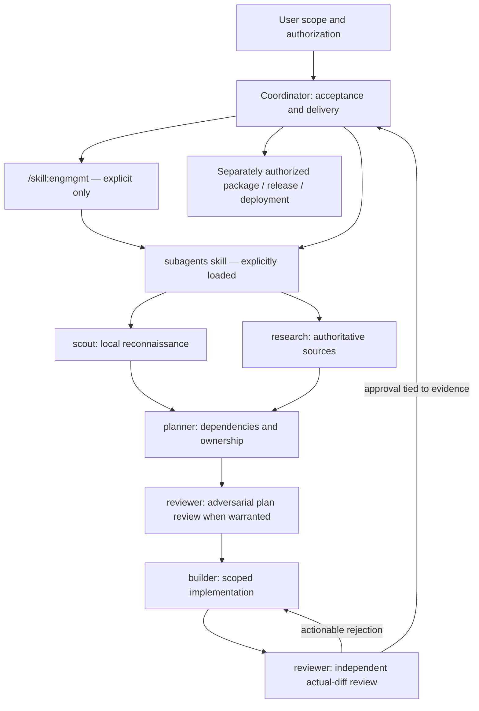
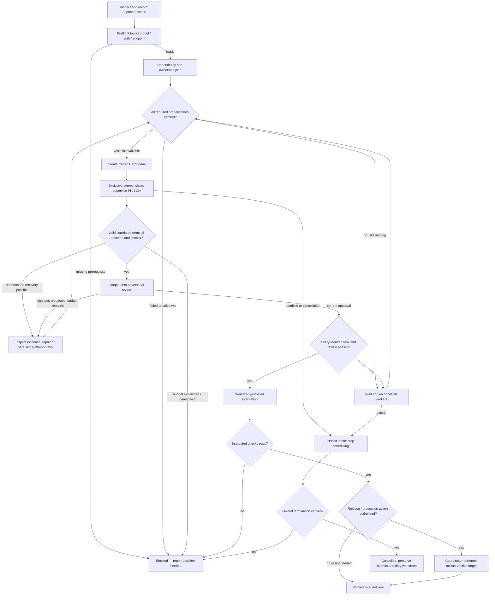

# Architecture

pinata is a normal Pi package: two skills, five prompt templates, and three small
Node modules. `pinata.mjs` coordinates finite-lived commands, `worker.mjs`
supervises one process at a time, and `core.mjs` shares contracts/OS primitives.
There is no resident pinata service.

## Persona relationships

Not every role is required. Scouts and research run concurrently only when their
inputs are independent. All roles and repairs share the run's concurrency budget.

## Lifecycle and barriers

## Control and evidence

1. Pi's bash tool invokes the Node helper with JSON input paths.
2. A coordinator lock protects atomic manifest updates. Separate runs do not have
   a shared lock; coordinate their ownership yourself.
3. Herdr creates labelled, unfocused workspaces. pinata captures workspace, tab,
   terminal and pane IDs and checks the original foreground shell before sending
   a quoted Node worker command through `pane run`.
4. The worker claims the immutable attempt, consumes its private environment
   capsule, and starts Pi in JSON mode with explicit model, reasoning, persona,
   task/context, tools, and session directory.
5. It drains LF-framed JSON stdout and separate stderr. It rejects incomplete
   lifecycle streams, assistant errors/abort/length stops, unexpected models,
   malformed results, nonzero exit, surviving subprocesses, and deadline failures.
6. It runs approved checks independently, snapshots changes, enforces ownership
   and truthful changed-file lists, and writes the outcome atomically.
7. The coordinator verifies dependency outcomes and evidence again before review
   and integration. Review fingerprints bind the actual result and checks, not
   merely a pane status or the reviewer's confidence.

The optional official Herdr Pi integration is useful for coordinator/TUI
inspection. It is **not bundled** and is not completion evidence: the installed
integration skips JSON/print/RPC lifecycle reporting. A headless Herdr server
does not require a visible outer terminal.

## Boundaries and deliberate limits

- Repository text, worker output, fetched content, and check claims are untrusted.
  Task specifications and approved commands are coordinator-controlled.
- Pi project trust and tool allowlists are not an OS sandbox. A builder has bash;
  it can read accessible files, contact networks, or deliberately bypass workflow
  restrictions. Use an actual external sandbox for hostile code.
- Global skills/templates/extensions are suppressed in child discovery. A single
  persona is explicitly loaded; research additionally loads trusted pi-web-access.
  Project-local Pi configuration is not approved. Relevant instructions are
  copied into task context; applicable AGENTS.md remains guidance, not authority
  to expand scope.
- Inspection roles have read/search/list tools, not bash/edit/write. This is
  capability reduction, not a filesystem/security boundary.
- Process ownership uses PID, start time, command name, and process group plus
  observed descendants. A rapidly daemonizing child can escape observation; OS
  process containment is outside scope. Unknown ownership is retained/reported.
- State is Git-common-directory-local, mode 0700 directories/0600 files by
  default. Do not sync/upload it indiscriminately. Same-user tampering is not
  cryptographically prevented. Single-use environment capsules can contain
  explicitly approved secrets; unclaimed capsules require verified cancellation.
- Integration manages ordinary regular files up to 16 MiB, executable bits, and
  deletions. No symlink/submodule/LFS/filter-aware merge engine. Secret-bearing
  names such as `.env*`, `auth.json`, `.npmrc`, and `.netrc` are refused.
- Git-ignored files are not snapshotted as deliverables; ignored build output can
  keep a worktree dirty at cleanup. Dependency installation is not automatic.
- Check processes are bounded. Checks that intentionally update files are
  incorporated into builder evidence; integrated checks must not alter managed
  code/index. No implicit live-credential checks are permitted.
- This implementation is local, single-host orchestration. There is no remote
  worker scheduler, transactional remote deployment, persistent RPC backend, or
  automatic publication mechanism.

## Source contracts

Version-matched implementation evidence is in [validation](validation.md).
Primary references: [Pi packages](https://github.com/earendil-works/pi/blob/main/packages/coding-agent/docs/packages.md),
[skills](https://github.com/earendil-works/pi/blob/main/packages/coding-agent/docs/skills.md),
[JSON mode](https://github.com/earendil-works/pi/blob/main/packages/coding-agent/docs/json.md),
[Herdr automation](https://herdr.dev/docs/agent-automation/),
[CLI](https://herdr.dev/docs/cli-reference/),
[integrations](https://herdr.dev/docs/integrations/).
